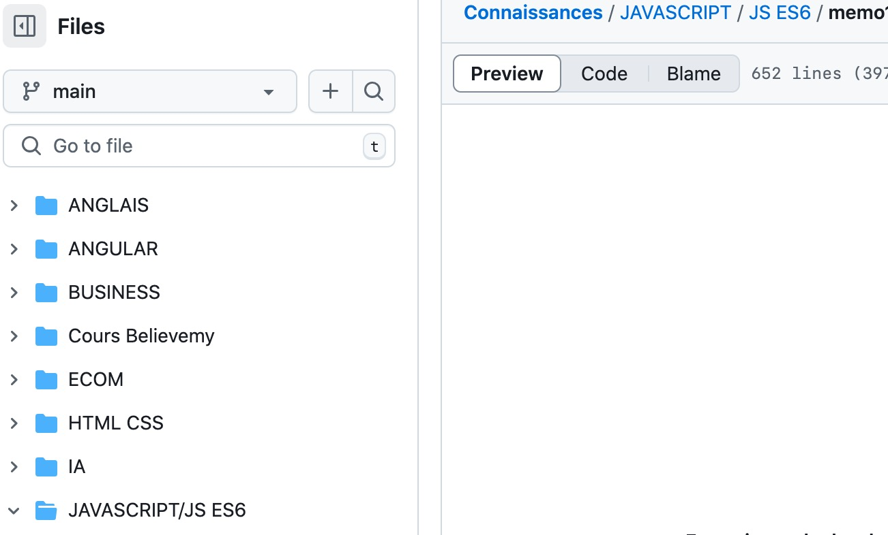
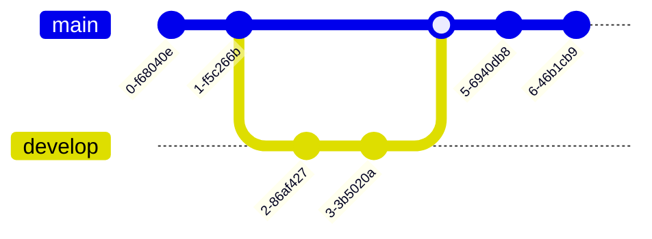

# Application de Surveillance des Marchés de Cryptomonnaies


### Environnement commun
Le projet sera réalisé entièrement en php (version 8) sur un serveur Apache avec une base de données (MySQL). Nous utiliserons `Composer` pour la gestion des dépendances PHP. GitHub sera utilisé pour le versionnement https://github.com/olfabre/CryptoWatch. 


### Environnement de développement
Un serveur de **développement** sera installé sur ma propre machine MacBook Pro.
La synchronisation se fera manuellement sur mon dépôt gitHub. 

### Environnement de production



```python
def 
```

 



```
```
