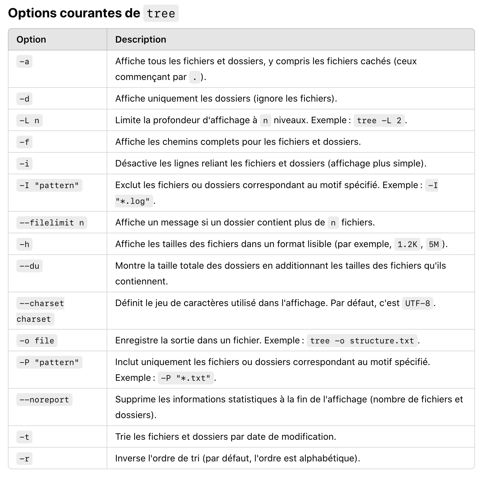

10 décembre au 16 décembre

- Mis en place du site kawaiimediagroup.com qui hébergera les fichiers de l'application (serveur de production environnement Apache et php version 8.2.26  )

- Mise en place d'une dépôt git https://github.com/olfabre/CryptoWatch

- Installation Base de donnée: 
  Nom de la base de données distante: admin_CryptoWatch

- Serveur de bases de données 

  localhost:3306 (valeurs par défaut de MariaDB, v10.3.39)

Nom de l'utilisateur de la base de données * cryptowatch

mot de passe: 0590135%

Accès: phpAdmin https://51.178.36.249:8443/phpMyAdmin/index.php?db=admin_CryptoWatch

- installation de composer version 2.6.5 à la racine
- installation bibliothèques "vlucas/phpdotenv": "^5.6" pour gérer le variables d'environnements entre le serveur Dev et Prod
- On fige l'environnement php en verison 7.4.* pour la comptatibilité avec doctrine

on installer docker sur le local (mon post)
J'ai récupérer docker desktop pour Catalina que l'on peut retrouver à l'adresse suivante https://github.com/docker/for-mac/issues/6671#:~:text=https%3A//desktop.docker.com/mac/main/amd64/93002/Docker.dmg

mais aussi sur mon dépôt dans le répertoire /docker_catalina/Docker.dmg

On doit l'installer sur le mac et l'ouvrir

ensuite sur le CLI, faire la commande

```bash > docker info ```

résultat:

```bash
Client:
 Context:    default
 Debug Mode: false
 Plugins:
  buildx: Docker Buildx (Docker Inc., v0.9.1)
  compose: Docker Compose (Docker Inc., v2.13.0)
  dev: Docker Dev Environments (Docker Inc., v0.0.5)
  extension: Manages Docker extensions (Docker Inc., v0.2.16)
  sbom: View the packaged-based Software Bill Of Materials (SBOM) for an image (Anchore Inc., 0.6.0)
  scan: Docker Scan (Docker Inc., v0.22.0)

Server:
 Containers: 0
  Running: 0
  Paused: 0
  Stopped: 0
 Images: 0
 Server Version: 20.10.21
 Storage Driver: overlay2
  Backing Filesystem: extfs
  Supports d_type: true
  Native Overlay Diff: true
  userxattr: false
 Logging Driver: json-file
 Cgroup Driver: cgroupfs
 Cgroup Version: 2
 Plugins:
  Volume: local
  Network: bridge host ipvlan macvlan null overlay
  Log: awslogs fluentd gcplogs gelf journald json-file local logentries splunk syslog
 Swarm: inactive
 Runtimes: runc io.containerd.runc.v2 io.containerd.runtime.v1.linux
 Default Runtime: runc
 Init Binary: docker-init
 containerd version: 770bd0108c32f3fb5c73ae1264f7e503fe7b2661
 runc version: v1.1.4-0-g5fd4c4d
 init version: de40ad0
 Security Options:
  seccomp
   Profile: default
  cgroupns
 Kernel Version: 5.15.49-linuxkit
 Operating System: Docker Desktop
 OSType: linux
 Architecture: x86_64
 CPUs: 4
 Total Memory: 7.675GiB
 Name: docker-desktop
 ID: NCHV:Q4XQ:AED5:OIOV:NWFH:TZ5N:FBW7:DWHI:IJM7:SQN3:3I7R:U6QG
 Docker Root Dir: /var/lib/docker
 Debug Mode: false
 HTTP Proxy: http.docker.internal:3128
 HTTPS Proxy: http.docker.internal:3128
 No Proxy: hubproxy.docker.internal
 Registry: https://index.docker.io/v1/
 Labels:
 Experimental: false
 Insecure Registries:
  hubproxy.docker.internal:5000
  127.0.0.0/8
 Live Restore Enabled: false
```

le serveur distant est en php 7.4.33

Nous allons donc charger dans un premeir temps une image légère pour cette même version php 7.4.33

```bash
docker pull php:7.4.33-cli
```


On le voit afficher sur docker desktop dans l'onglet image


mais aussi sur cli

```bash
(base) olfabre@MacBook-Pro-de-Olivier ~ % docker images
REPOSITORY   TAG          IMAGE ID       CREATED       SIZE
php          7.4.33-cli   7bbbb12d1498   2 years ago   474MB
```


Ensuite je vais sur les préférences de mon IDE PhpStorm


Aller et cliquer les parametrages pour **PHP**


Php language level, on prend la version 7.4

Dans la partie CLI Interpreter , on clique sur le 3 petits points: une fenêtre s'ouvre


On clique sur la croix en haut à gauche.


On sélectionne "from Docker..."

Une fenêtre s'ouvre

On sélectionne docker


On clique sur "new..."

On renomme par exemple "Serveur Docker 7.44.33"

On sélectionne "Detect executable paths automatically"

On sélectionne Docker for Mac "default" car on a Docker Desktop installé

et on clique sur "OK"


On sélectionne l'image que l'on souhaite prendre, dans notre cas, php:7.4.33-cli

On clique sur "ok"

On s'apperçoit que php n'est pas installé, ce qui est normal car il n y a pas encore de conteneur en route à partir de cette image


---


J'ai installé la bibliothèque tree 

brew install tree

qui permet d'avoir une représentation visuelle de mes arborescences de dossiers au sein d'un projet
tree > structure.txt

tree



----


Dans un répertoire nommé `docker`dans le projet`CryptoWatch` je créé un fichier `docker-compose.yml`

j'y colle:


```yaml
version: '3.8'

services:
  web:
    image: php:8.0.30-apache
    container_name: cryptowatch-web
    ports:
      - "8080:80"
    volumes:
      - "/Users/olfabre/Desktop/SERVEUR DEV/CryptoWatch:/var/www/html"
      - "./php-config/php.ini:/usr/local/etc/php/php.ini"
    networks:
      - cryptowatch-network

  db:
    image: mariadb:10.3.39
    container_name: cryptowatch-db
    environment:
      MYSQL_ROOT_PASSWORD: rootpassword
      MYSQL_DATABASE: cryptowatch
      MYSQL_USER: user
      MYSQL_PASSWORD: userpassword
    volumes:
      - db-data:/var/lib/mysql
    ports:
      - "3306:3306"
    networks:
      - cryptowatch-network

  phpmyadmin:
    image: phpmyadmin:5.2.1
    container_name: cryptowatch-phpmyadmin
    environment:
      PMA_HOST: cryptowatch-db
      PMA_PORT: 3306
      MYSQL_ROOT_PASSWORD: rootpassword
    ports:
      - "8081:80"
    networks:
      - cryptowatch-network

volumes:
  db-data:

networks:
  cryptowatch-network:

```


C'est la représentation de mon serveur distant à savoir:

Serveur Débian avec Php 8.0.30

Serveur Db Maria Db (Mysql) 10.3.39

php Admin 5.2.1

Les données sont ici persistantes dans le volume `db-data`

Donc nous avons :

1 container qui se nomme `cryptowatch-web`qui est la partie serveur web debian php apache

1 container qui se nomme `cryptowatch-db`qui est le serveur Maria DB (mysql)

1 container qui se nomme `cryptowatch-phpmyadmin` qui est l'accès admin pour la BD

je centralise les fichiers Cron dans le projet

dans le répertoire `/cron`  il y aura cryptowatch.cron qui contiendra toutes les tâches Cron

`update-cron.sh` qui sera le ccript pour installer les tâches Cron


### **Contenu du fichier `cryptowatch.cron`**

Définissez vos tâches Cron dans un format standard :

```
bash


Copier le code
# Exécuter le fichier PHP toutes les heures
0 * * * * /usr/bin/php /var/www/html/script.php >> /var/log/script.log 2>&1
```

Ajoutez autant de tâches que nécessaire. Ce fichier sera **identique** en local et en production


### **Script pour appliquer le fichier Cron : `update-cron.sh`**

Créez un script shell pour appliquer les tâches Cron en local ou en production. Exemple :

```
bash


Copier le code
#!/bin/bash

# Chemin vers le fichier des tâches Cron
CRON_FILE="$(pwd)/cron/cryptowatch.cron"

# Vérification que le fichier existe
if [ ! -f "$CRON_FILE" ]; then
    echo "Fichier Cron introuvable : $CRON_FILE"
    exit 1
fi

# Installer les tâches Cron pour l'utilisateur actuel
crontab "$CRON_FILE"

echo "Tâches Cron installées avec succès à partir de : $CRON_FILE"
```

Donnez les droits d'exécution à ce script :

```
bash


Copier le code
chmod +x cron/update-cron.sh
```


### **Utilisation en local**

1. Après avoir configuré ou modifié le fichier 

   ```
   cryptowatch.cron
   ```

   , exécutez le script pour appliquer les tâches Cron en local :

   ```
   bash
   
   
   Copier le code
   ./cron/update-cron.sh
   ```

2. Vérifiez que les tâches Cron sont bien configurées :

   ```
   bash
   
   
   Copier le code
   crontab -l
   ```


### **Intégration avec Docker**

Si vous utilisez Docker pour d'autres services en local (comme PHP ou MariaDB), assurez-vous que votre script `cryptowatch.cron` utilise le bon chemin pour PHP :

- **En local :** `/usr/bin/php` (sur votre machine).
- **En production :** `/usr/bin/php` (sur le serveur Debian).

Vous pouvez tester vos tâches en exécutant directement la commande dans un conteneur si nécessaire :

```
bash


Copier le code
docker exec -it cryptowatch-web php /var/www/html/script.php
```

 
